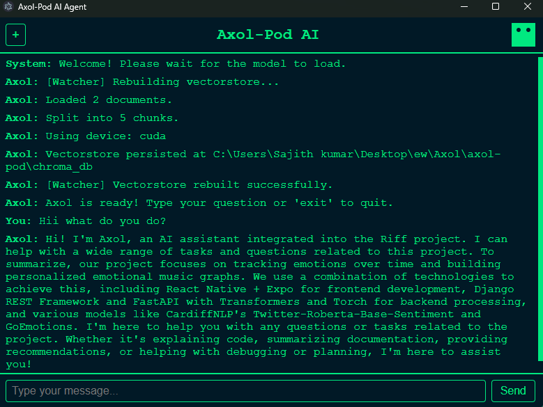

# Axol-Pod

**Axol-Pod** is a privacy-focused local AI assistant desktop app built using **Electron Forge**, **Vite**, and **TypeScript**.  
It lets you chat with an LLM, index your local documents, and interact with your knowledge base — all **offline**, ensuring **complete data privacy**.

---

##  Features

-  **Chat locally** with an LLM (no API calls or data sharing)
-  **Add PDFs and text files** to build your local knowledge base
-  **Modular architecture** for easy extension (e.g., custom models, new tools)
-  **100% offline** — data never leaves your machine
-  **Cross-platform** — runs on Windows, macOS, and Linux

---

##  Tech Stack

- **Electron Forge** — for packaging and desktop app support  
- **Vite + TypeScript** — for fast, modular frontend builds  
- **Node.js + Python** — for backend and model orchestration  
- **Ollama** — to run local LLMs such as **Llama 3** (configurable)

---


## Requirements

Before running Axol-Pod, make sure you have:

- [Node.js](https://nodejs.org/en/) (v18 or higher)
- [Python 3.10+](https://www.python.org/downloads/)
- [Ollama](https://ollama.ai/download) installed and running  
  (Required for running local LLMs like **Llama 3**)

> 🧩 The model used defaults to **Llama 3**, but you can change it in `main.py`.  
> For example:
> ```python
> model_name = "llama3"  # change this to "mistral", "phi3", etc.
> ```
> In future updates, a **custom fine-tuned model** will be added to improve responses and personalization.

---

## 🧩 Setup & Development

Clone the repository:

```bash
git clone https://github.com/yourusername/axol-pod.git
cd axol-pod
````

Install dependencies:

```bash
npm install
```

Run the app in development mode:

```bash
npm run start
```
---

Contributions, ideas, and feedback are always welcome!
Feel free to open an issue or submit a pull request.

---
